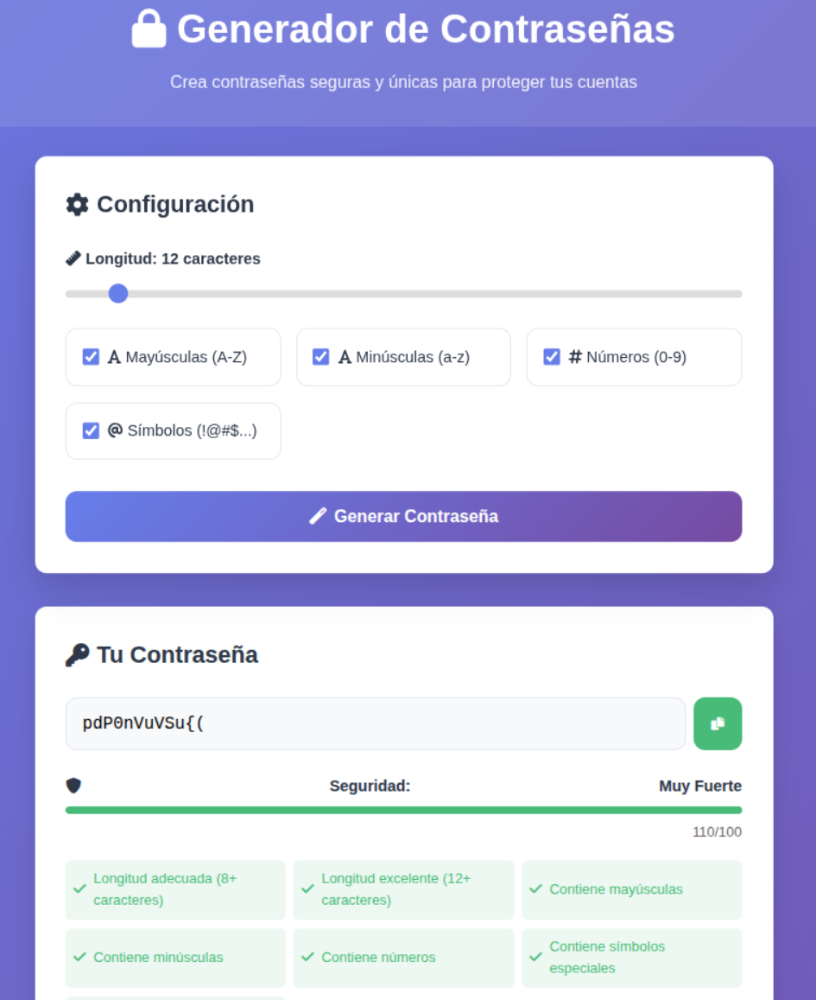

# 🔐 Generador de Contraseñas Seguras

Un generador de contraseñas moderno y profesional desarrollado con HTML, CSS y JavaScript vanilla.



## ✨ Características

- 🎯 **Personalizable**: Controla longitud y tipos de caracteres
- 🛡️ **Evaluación de seguridad**: Análisis detallado de fortaleza
- 📋 **Copiar al portapapeles**: Un click para copiar
- 📚 **Historial**: Guarda las últimas contraseñas generadas
- 📱 **Responsive**: Funciona en móviles y escritorio
- 🎨 **Diseño moderno**: Interfaz atractiva y animaciones suaves
- 💾 **Persistencia**: El historial se guarda localmente

## 🚀 Demo en Vivo

[Ver Demo](https://limense.github.io/generador-contrase-as)

## 🛠️ Tecnologías Utilizadas

- **HTML5**: Estructura semántica
- **CSS3**: Diseño moderno con Grid y Flexbox
- **JavaScript ES6+**: Lógica y funcionalidad
- **Font Awesome**: Iconos
- **LocalStorage**: Persistencia de datos

## 📋 Funcionalidades

### Generación de Contraseñas
- Longitud configurable (4-128 caracteres)
- Mayúsculas, minúsculas, números y símbolos
- Algoritmo que garantiza variedad de caracteres
- Generación criptográficamente segura

### Evaluación de Seguridad
- Puntuación de 0 a 100
- Análisis de criterios múltiples
- Clasificación visual (Débil, Moderada, Fuerte, Muy Fuerte)
- Indicadores detallados de mejora

### Gestión de Historial
- Guarda las últimas 10 contraseñas
- Información de timestamp y seguridad
- Copiar y eliminar contraseñas individuales
- Persistencia en localStorage

## 🔧 Instalación y Uso

1. **Clona el repositorio**:
```bash
git clone https://github.com/Limense/password-generator.git
cd password-generator
```

2. **Abre en tu navegador**:
   - Simplemente abre `index.html` en tu navegador
   - O usa un servidor local:
```bash
# Con Python
python -m http.server 8000

# Con Node.js (si tienes live-server)
npx live-server
```

3. **¡Listo!** Ya puedes generar contraseñas seguras

## 💡 Cómo Usar

1. **Configura la longitud** usando el slider
2. **Selecciona los tipos de caracteres** que deseas incluir
3. **Haz click en "Generar Contraseña"**
4. **Copia la contraseña** con el botón de copiar
5. **Revisa el historial** para contraseñas anteriores

## 🧮 Algoritmo de Seguridad

El sistema evalúa las contraseñas basándose en:

- **Longitud** (20-30 puntos): 8+ caracteres requeridos
- **Mayúsculas** (15 puntos): A-Z
- **Minúsculas** (15 puntos): a-z  
- **Números** (15 puntos): 0-9
- **Símbolos** (25 puntos): !@#$%^&*()...
- **Variedad** (10 puntos): Diversidad de caracteres únicos

### Clasificación:
- **0-49**: 🔴 Débil
- **50-69**: 🟡 Moderada  
- **70-84**: 🟢 Fuerte
- **85-100**: 🟣 Muy Fuerte

## 🔒 Seguridad y Privacidad

- ✅ **100% Local**: Todo se ejecuta en tu navegador
- ✅ **Sin envío de datos**: No se envía información a servidores
- ✅ **Código abierto**: Puedes revisar todo el código
- ✅ **Sin dependencias externas**: Solo usa APIs estándar del navegador

## 🌟 Características Técnicas

### CSS
- Variables CSS para theming
- Grid y Flexbox para layouts responsive
- Animaciones CSS suaves
- Mobile-first design

### JavaScript
- ES6+ features (arrow functions, destructuring, etc.)
- Modular code organization
- Error handling robusto
- Local storage management
- Clipboard API integration


## 📜 Licencia

Este proyecto está bajo la Licencia MIT - ver el archivo [LICENSE](LICENSE) para detalles.

## 👨‍💻 Autor

**Limense**
- GitHub: [@Limense](https://github.com/Limense)
- LinkedIn: [Tu LinkedIn]

## 🙏 Agradecimientos

- Font Awesome por los iconos
- La comunidad de desarrolladores por la inspiración
- Recursos de seguridad de OWASP

---

⭐ ¡Si te gusta este proyecto, dale una estrella en GitHub!
